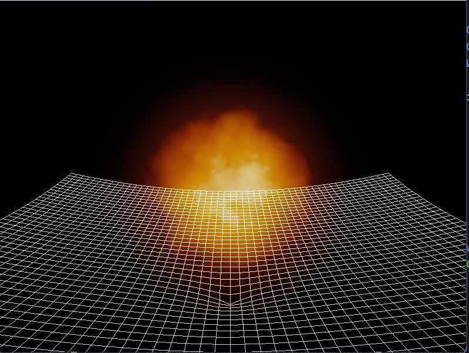
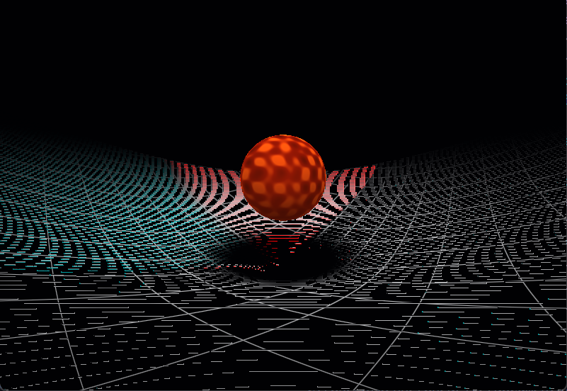
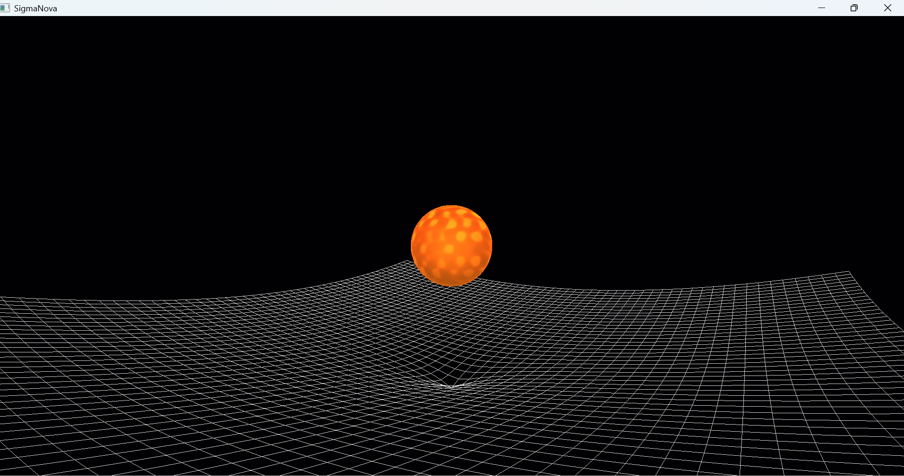
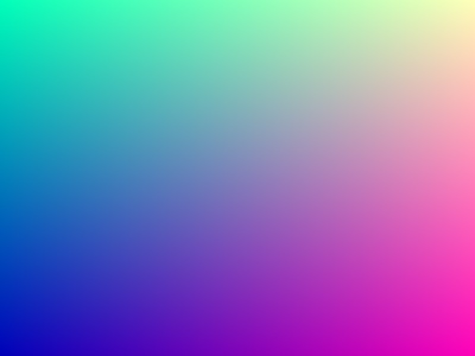
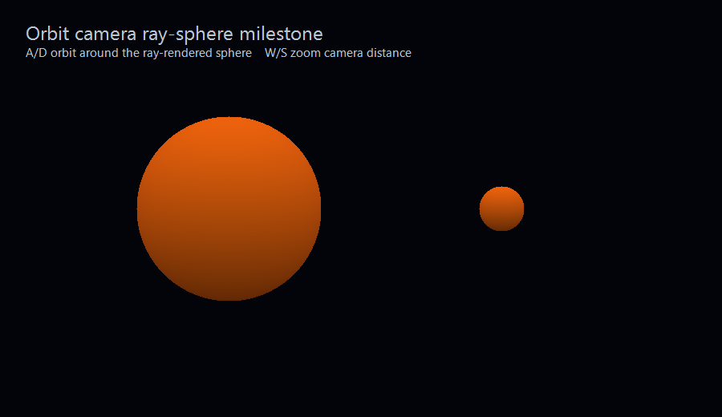
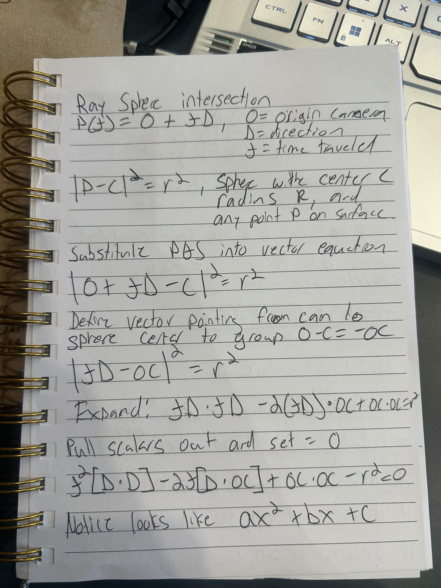
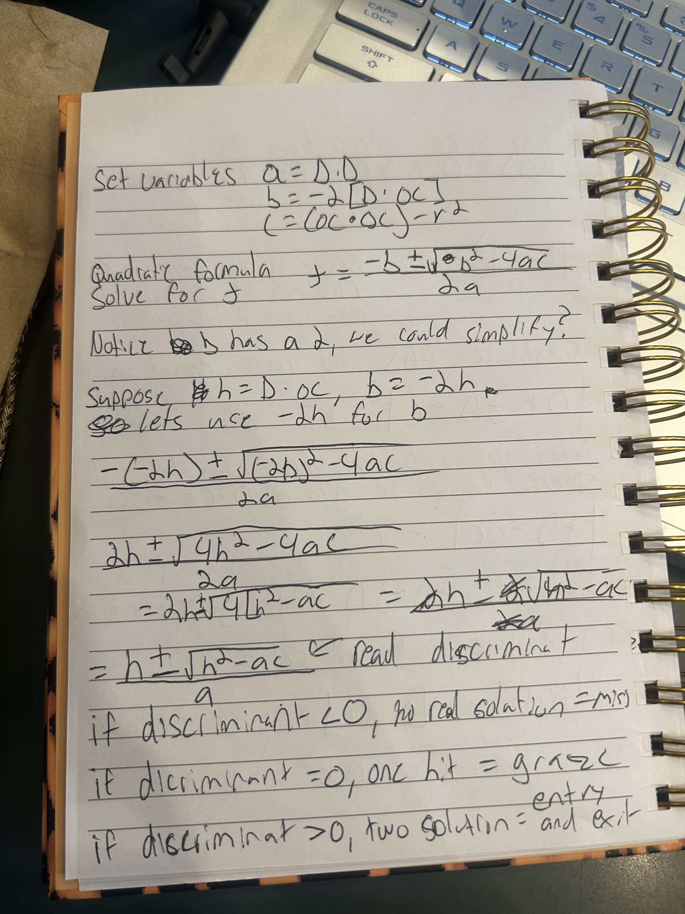
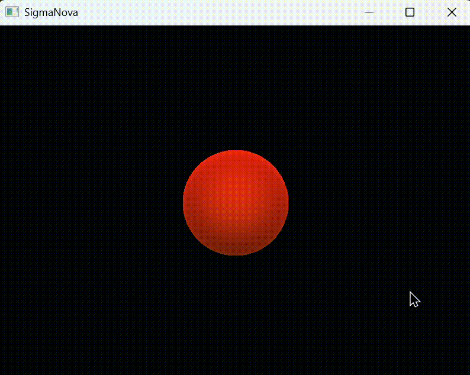

# SigmaNova

SigmaNova is a C++/OpenGL project for building a real-time supernova visualization engine.

The goal is to start from a clean graphics programming foundation, then build toward an interactive volumetric renderer that can show a glowing, expanding supernova-like cloud.

## Current Milestone

The current build renders a red-giant-inspired volumetric gas cloud above a mesh-rendered spacetime fabric. The fullscreen fragment shader computes camera rays, finds entry/exit bounds through an enlarged gas volume, raymarches through procedural density, applies emission and absorption/transmittance, tone maps the result, and blends a soft halo over the grid.

This milestone moves the star away from a clean mathematical sphere edge. The gas boundary now dissolves through a noise-warped density field, so the silhouette reads more like billowing plasma than a shaded ball.

## Rendering Notes

The spacetime-fabric grid started as a fullscreen fragment-shader experiment. The early prototype ray marched against a curved surface and procedurally drew grid lines per pixel. That proved the idea, but it caused aliasing: where the grid compressed near the gravity well, thin procedural lines could fall between pixel samples, creating noisy red/purple/cyan artifacts and broken-looking line segments.

The fix is to render the fabric as real OpenGL line geometry instead of as a raymarched shader illusion. C++ now generates grid vertices, bends those vertices with a simple gravity-well equation, uploads them to a VBO/VAO, and draws them with `GL_LINES`. The red giant remains ray-rendered in the fullscreen shader while the fabric is a separate mesh-rendered object.

## Milestone Progression

### 1. Fullscreen Shader Gradient

This milestone proved that the renderer could use a fullscreen quad as a shader canvas. C++ sends `u_time` and `u_resolution` uniforms, and the fragment shader uses `gl_FragCoord` to compute a color for each pixel.

### 2. Orbit Camera Ray-Sphere

This milestone adds a ray-sphere intersection and a C++ orbit camera. The camera sends position, forward, right, and up vectors into GLSL, letting the fragment shader generate camera-controlled rays for each pixel.

#### Ray-Sphere Math Notes

These notes show the derivation behind the ray-sphere intersection used in the fragment shader. The shader starts from the ray equation `P(t) = origin + t * direction`, substitutes that into the sphere equation, and solves the resulting quadratic to find whether the ray hits the sphere.

### 3. Red Giant Pulse

[Watch the full MP4 demo](assets/captures/red-giant-pulse.mp4)

This milestone starts the visual language for the pre-supernova star. The shader keeps the ray-sphere foundation, then layers in red-orange surface color, time-varying emission, rim glow, and center glow so the object reads more like a hot red giant than a matte test sphere.

### 4. Mesh Spacetime Fabric

This milestone replaces the shader-raymarched grid prototype with real OpenGL line geometry. C++ generates a grid of vertices, bends the grid with a simple gravity-well height function, uploads it to a VBO/VAO, and draws it with `GL_LINES`. The result is a cleaner black-and-white spacetime fabric without the noisy shader-line artifacts.

### 5. Volumetric Gas And Procedural Noise

This milestone moves the red giant from a surface-shaded sphere toward a volumetric gas object. The fragment shader computes sphere entry/exit bounds, marches through the volume, samples density along the ray, and accumulates emissive gas color. Density is now separated into a `sample_density` function so the current procedural shader field can later be replaced by a C++/texture-backed simulation field.

The gas texture is moving from simple sine-band modulation toward value-noise/FBM-style procedural noise. The goal is to replace visible sine spokes with more organic plasma-like clumps.

Reference used for this direction:

- [The Book of Shaders: Noise](https://thebookofshaders.com/11/) - explains random functions, value noise, smooth interpolation, and how noise can create organic shader patterns.
My explanation on the pseudo-random noise.
 Ok so imagine we have a cube. This cube has 8 corners. Assign a random value at each of the 8 corners. Then interpolate (find a value between these two values) using a percentage (which is based off a sample point inside the cube, and based on how far along to sample point is in the cube (if its 30% across the cube in x axis (local.x = .3), or more than halfway up in the y axis like 60% (local.y = .6), etc)), these local values we use for interpolation percentages we use mix() and then smooth it out for smoother transitions.
    - Local tells you where you are inside the cube. You can use local as a mix percentage but that makes the transition between neighboring cells change direction to sharply at cube boundaries. This can create faint grid like creases.
        - we do local = local * local * (3.0 - 2.0 * local)
            - this equation is a hermite fade or smoothstep
            - smooths interpolation weights before mxing which flattnes the slope at cell boundaries so the value noise does not show hard gride like creases
        - Fractal brownian motion (fbm) layers these noise patterns on top of eachother, each layer being an octave
            - Layer 1: lower freq high amp
                - Big soft blobs
            - layer 2: higher freq smaller amp
                - medium details
            - layer 3: even higher freq and even lower amp
                - smaller detais
        - Higher frequencies make smaller more detailed shapes.
            - Higher frequencies means the noise changes more often in the same space so the blobs/features get tighter and smaller
        - Amplitude is how much that noise layer changes the final result
            - High amps means the layer is visually evident by alot
            - lower amps means it adds a subtle texture 

### 6. Emission, Absorption, And Dissolved Gas Edge

This milestone finishes the core Chapter 5 volumetric look. The shader now accumulates emitted light through the gas while tracking transmittance, so dense gas can attenuate light behind it instead of every sample simply adding brightness. A simple tone-mapping step keeps the bright core readable instead of clipping immediately to flat white.

The clean sphere silhouette was replaced with a dissolved gas boundary. The raymarch uses a larger bounding sphere, but the density field decides where the star visually ends. Low-frequency noise warps the effective radius so tongues of gas can push past the nominal surface, and the old analytic rim/collar ring was replaced by a softer halo that blends through the remaining transmittance.

Current Chapter 5 status:

- Emission: working
- Absorption/transmittance: working
- Tone mapping: working
- Procedural gas density: working
- Dissolved noisy silhouette: working
- Next visual target: chunkier animated red-supergiant convection cells

## Next Up

Chapter 6 is focused on animated fields and live tuning. The next work should make the gas motion feel intentional instead of hardcoded:

- expose noise speed, scale, turbulence strength, absorption strength, and emission strength as uniforms
- add keyboard controls or debug constants for quick tuning
- push the gas toward large red-supergiant convection cells: dark red lanes, orange body, and yellow-hot patches
- capture a fresh GIF once the motion reads well

## Performance Notes

The volumetric pass is the main performance cost because each visible pixel raymarches through the gas and samples procedural noise repeatedly. A first optimization pass reduced the measured frame time from about `24.0 ms/frame` to `6.84 ms/frame`, improving the scene from roughly `42 FPS` to `146 FPS` on the current machine while preserving the dissolved gas edge and turbulent core.

Changes made:

- replaced the slower sine hash with a cheaper multiplicative hash
- split procedural noise into full-quality and cheap paths
- kept domain-warped noise for the main convection cells
- used cheaper/no-warp noise for fine detail and surface-edge warping
- normalized FBM output so changing octave counts does not drastically change the look
- added early exits before expensive noise when a sample is outside the possible gas volume
- tightened the raymarch bound from `1.4` to `1.35`
- added adaptive step sizing so thin outer gas uses larger steps than the dense core
- added a title-bar frame-time/FPS readout for profiling

`glfwSwapInterval(0)` is currently used during profiling so the FPS readout reflects shader cost instead of monitor refresh rate. For a polished demo capture, this can be changed back to `glfwSwapInterval(1)`.

## Planned Stack

- C++
- CMake
- OpenGL
- GLFW
- GLAD
- GLM
- vcpkg

## First Milestone

Set up the project from scratch and prove the toolchain works:

- Create the CMake project structure.
- Build a minimal C++ executable.
- Add an OpenGL window with GLFW.
- Load OpenGL functions with GLAD.
- Print the OpenGL version.
- Clear the window to a visible color.
- Close cleanly with Escape.

## Build Status

### 2026-06-28

- Started the SigmaNova repository and README.
- Set up the first OpenGL "Hello World" milestone.

### 2026-06-29

- Added Escape key handling so the window can close cleanly.
- Drew the first triangle.
- Built the first OpenGL triangle rendering pipeline.
- Added basic shader file loading error output.

### 2026-06-30

- Cleaned up early project code and spacing.
- Added indexed rectangle rendering with an EBO.
- Added a uniform-driven shader color so the shape pulses green over time.

### 2026-07-02

- Added a reusable Shader class.
- Switched from triangle rendering to a fullscreen quad.
- Added time and resolution uniforms for a fullscreen shader gradient.
- Added a ray-sphere intersection shader.
- Added a C++ orbit camera with keyboard controls.
- Sent camera position and basis vectors into the fragment shader.
- Tuned the ray-rendered sphere into a red-giant-inspired emissive pulse.

### 2026-07-03

- Replaced the shader-raymarched spacetime fabric prototype with mesh-rendered `GL_LINES` geometry.
- Added a separate grid shader path for the fabric while keeping the star in the fullscreen ray shader.
- Hand-derived and documented the ray-sphere math used for entry/exit bounds.
- Moved the star from one-hit ray-sphere surface shading to volumetric raymarching.
- Added `sample_density` as the bridge between the renderer and future simulation-backed gas fields.
- Replaced sine-band surface patterns with value-noise/FBM-style procedural gas.
- Added density-driven temperature color: dark red gas, orange mid-density, and hot yellow-white core.
- Fixed the corona/black-ring issue by lifting edge density and matching inner/outer glow behavior.
- Added additive blending so the star and corona add light over the spacetime fabric instead of painting dark pixels over it.
- Added milestone captures for the mesh fabric, ray-sphere notes, and volumetric gas progress.

### 2026-07-04

- Added free-camera navigation with WASD movement, vertical movement, mouse drag-look, and arrow-key look controls.
- Matched the fullscreen raymarch camera FOV to the mesh grid projection so the star and fabric sit in the same visual camera space.
- Added absorption/transmittance to the volumetric raymarch so dense gas attenuates light behind it.
- Added tone mapping to keep the bright core readable.
- Enlarged the gas march bounds and moved the visible edge into the density field instead of the hit sphere itself.
- Noise-warped the effective gas radius to dissolve the clean circular silhouette into a billowing plasma edge.
- Replaced the hard rim/collar look with a softer transmittance-aware halo.
- Captured the dissolved volumetric gas milestone image.
- Optimized the volumetric raymarch path from about `24.0 ms/frame` to `6.84 ms/frame` by tiering noise quality, adding early rejects, tightening the march bound, and using adaptive step sizes.
